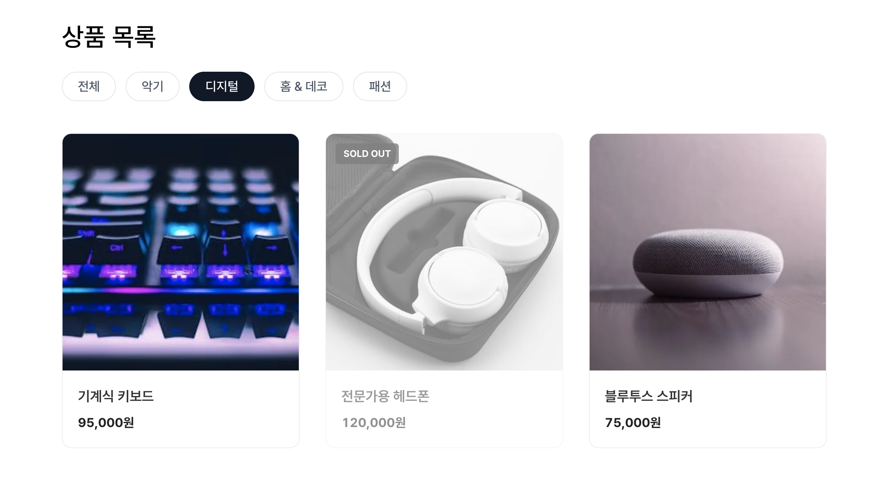

## 실습 요구사항

### 목표: 필터링 기능과 조건부 UI가 적용된 쇼핑몰

#### 사용자 인터페이스

구현해야 할 화면을 확인하세요.  
카테고리 필터 버튼을 누르면 상품이 필터링되어 출력됩니다.



#### 실습 가이드

1. **컴포넌트 설계(추가)**  
    - `ProductCategoryFilter`: 카테고리 목록을 버튼 형태로 렌더링하고, 클릭 시 상태를 변경합니다.
2. **기능 요구사항**  
    - 카테고리 필터링 
      - `selectedCategory` 상태를 생성합니다. (기본값: `'all'`)
      - 상단에 카테고리 버튼 목록을 만들고 클릭 시 상태를 변경합니다.
    - 품절 상품 스타일링
      - `isSoldOut`이 `true`인 경우, 카드에 `.soldOut` 클래스를 추가합니다.
      - 시각적으로 흐리게 처리하고 사용자에게 정보를 제공합니다.
3. **접근성 준수**  
    - 선택된 카테고리 버튼에 `aria-current="page"`를 적용하여 현재 위치를 표시합니다.

#### 참고

아래 컴포넌트 트리 구조를 참고하세요.

```sh
.
├── MISSION.md
├── components/
│   ├── ProductCard.module.css
│   ├── ProductCard.tsx # 수정
│   ├── ProductCategoryFilter.module.css
│   ├── ProductCategoryFilter.tsx # 추가
│   ├── ProductList.module.css
│   └── ProductList.tsx # 수정
├── data/
│   ├── mock.ts
│   └── types.ts
├── pages/
│   └── product/
│       ├── index.tsx # 수정
│       └── style.module.css
└── utils/
    └── getPexelmage.ts
```